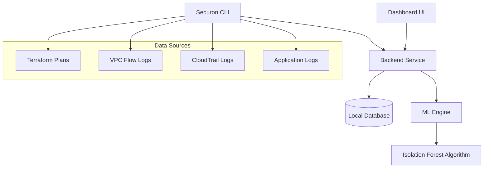
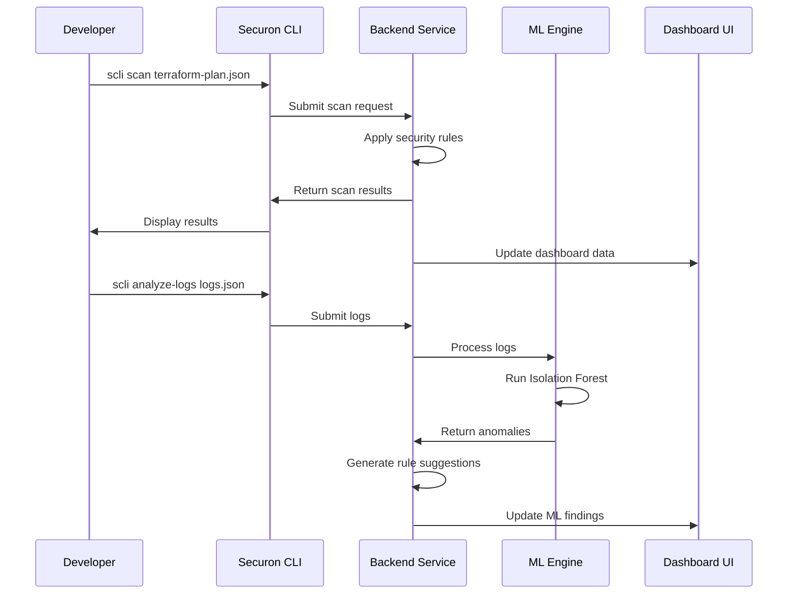
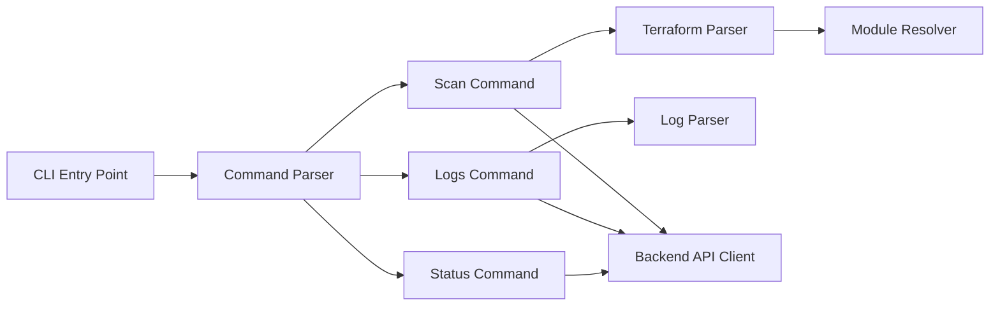
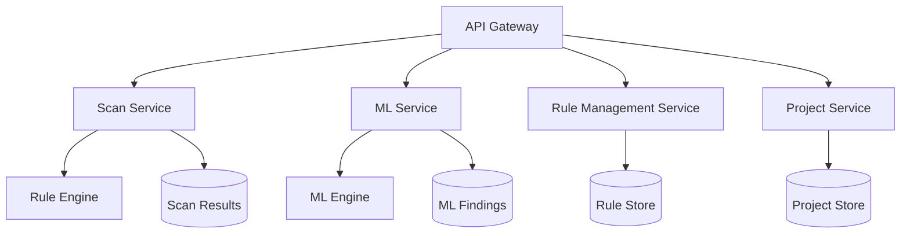
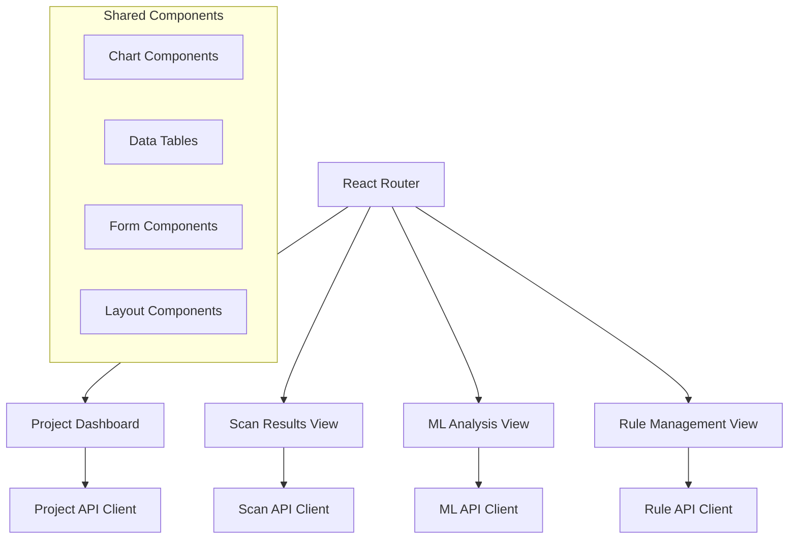
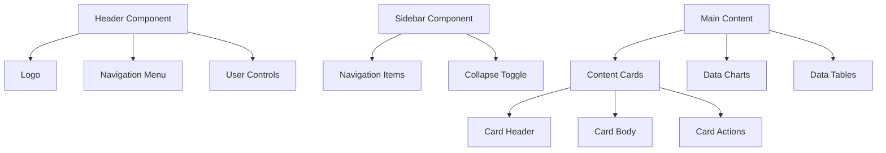
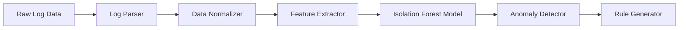

# Securon Platform Design Document

## Overview

Securon is a comprehensive cloud security analysis and governance platform consisting of three interconnected components: a Command Line Interface (CLI), a centralized backend service, and a modern dashboard UI. The platform is designed to operate in both online and offline environments, making it suitable for restricted enterprise settings, audits, and demonstrations.

The architecture follows a client-server model where the CLI and Dashboard UI are client interfaces that communicate with a centralized backend service. The backend serves as the single source of truth, managing security rules, scan results, machine learning analysis, and user decisions.

## Architecture

### High-Level Architecture



### Component Interaction Flow



## Components and Interfaces

### 1. Command Line Interface (CLI)

The CLI is a lightweight, scriptable interface that provides the primary operational capabilities of the platform.

#### Core Commands

- `scli scan <terraform-plan>` - Analyze Terraform infrastructure plans
- `scli analyze-logs <log-file>` - Submit logs for ML analysis
- `scli status` - Check platform status and recent activity
- `scli config` - Configure CLI settings and backend connection

#### CLI Architecture



#### Terraform Module Resolution

The CLI must handle modular Terraform codebases by:
- Parsing `terraform plan` output to understand resource dependencies
- Resolving module references and variable passing
- Building a complete infrastructure graph including all modules
- Analyzing security rules across the entire codebase structure

### 2. Backend Service

The backend service acts as the central intelligence hub, managing all platform state and orchestrating analysis workflows.

#### Core Services

- **Scan Service**: Processes infrastructure scans and applies security rules
- **ML Service**: Orchestrates machine learning analysis workflows
- **Rule Management Service**: Manages static and ML-derived security rules
- **Project Service**: Handles project organization and multi-tenancy
- **API Gateway**: Provides REST API for CLI and Dashboard communication

#### Backend Architecture



### 3. Dashboard UI

The dashboard provides a modern, clean interface for visualization, analysis, and decision-making, following the allfeat.org design aesthetic.

#### UI Architecture



#### UI Design System

The dashboard follows the allfeat.org design approach with the following design principles:

**Layout Structure:**
- Clean header with logo, navigation, and user controls
- Grid-based content layout with consistent spacing
- Collapsible sidebar navigation with clean icons
- Card-based content organization with subtle shadows
- Responsive design that adapts to different screen sizes

**Visual Design:**
- Modern typography with clear hierarchy
- Restrained color palette with strategic accent colors
- Minimal visual noise and generous whitespace
- Subtle hover states and smooth transitions
- Clean data visualizations with minimal styling

**Component Design:**


#### Technology Stack

- **Frontend Framework**: React with TypeScript
- **Styling**: Tailwind CSS for utility-first styling
- **UI Components**: Custom components following allfeat.org design patterns
- **Charts**: Chart.js or D3.js for data visualizations
- **Icons**: Lucide React or Heroicons for consistent iconography
- **State Management**: React Context API or Zustand for lightweight state management

## Data Models

### Core Entities

#### Project
```typescript
interface Project {
  id: string;
  name: string;
  description: string;
  createdAt: Date;
  updatedAt: Date;
  ruleSetId: string;
  settings: ProjectSettings;
}
```

#### Scan Result
```typescript
interface ScanResult {
  id: string;
  projectId: string;
  terraformPlanHash: string;
  timestamp: Date;
  status: 'completed' | 'failed' | 'in_progress';
  findings: SecurityFinding[];
  summary: ScanSummary;
}

interface SecurityFinding {
  ruleId: string;
  severity: 'critical' | 'high' | 'medium' | 'low';
  resource: string;
  message: string;
  remediation: string;
}
```

#### ML Analysis
```typescript
interface MLAnalysis {
  id: string;
  projectId: string;
  logDataHash: string;
  timestamp: Date;
  anomalies: Anomaly[];
  proposedRules: ProposedRule[];
  metrics: MLMetrics;
}

interface Anomaly {
  id: string;
  type: 'suspicious_ip' | 'unusual_port' | 'abnormal_transfer' | 'rare_api_call';
  confidence: number;
  explanation: string;
  affectedResources: string[];
}
```

#### Security Rule
```typescript
interface SecurityRule {
  id: string;
  name: string;
  description: string;
  severity: 'critical' | 'high' | 'medium' | 'low';
  source: 'static' | 'ml_derived';
  condition: RuleCondition;
  remediation: string;
  isActive: boolean;
}
```

### Machine Learning Data Pipeline

#### Log Processing Pipeline


#### Feature Extraction
The ML engine extracts the following features from log data:
- Connection frequency patterns
- Port usage distributions
- Data transfer volume metrics
- API call frequency and timing
- Source/destination IP patterns
- Error rate patterns
- Authentication event patterns

## Development Environment

### Local Development Setup

The platform is designed for iterative development with immediate feedback capabilities:

#### Frontend Development
- **Development Server**: Vite or Create React App with hot-reload
- **Port**: Default localhost:3000 for UI development
- **Mock Data**: JSON files with sample scan results, ML findings, and project data
- **API Mocking**: MSW (Mock Service Worker) for backend API simulation during development

#### Backend Development
- **Development Server**: Node.js with Express or Fastify
- **Port**: Default localhost:8080 for API services
- **Database**: SQLite for local development with sample data
- **Hot Reload**: Nodemon for automatic server restart on code changes

#### CLI Development
- **Local Installation**: npm link for local CLI testing
- **Sample Data**: Pre-generated Terraform plans and log files for testing
- **Configuration**: Local config files for development backend connection

#### Sample Data Structure
```
/sample-data/
├── terraform-plans/
│   ├── basic-infrastructure.json
│   ├── modular-setup.json
│   └── complex-multi-region.json
├── logs/
│   ├── vpc-flow-logs.json
│   ├── cloudtrail-logs.json
│   └── application-logs.json
└── ml-results/
    ├── anomalies.json
    └── proposed-rules.json
```

#### Development Workflow
1. Start backend development server (`npm run dev:backend`)
2. Start frontend development server (`npm run dev:frontend`)
3. Install CLI locally (`npm run dev:cli`)
4. Test end-to-end workflows with sample data
5. View results immediately in browser dashboard

## Correctness Properties

*A property is a characteristic or behavior that should hold true across all valid executions of a system-essentially, a formal statement about what the system should do. Properties serve as the bridge between human-readable specifications and machine-verifiable correctness guarantees.*

### Core Scanning Properties

**Property 1: Terraform Plan Analysis Completeness**
*For any* valid Terraform plan file, the CLI scan should analyze all resources against the complete set of security rules and produce a structured report
**Validates: Requirements 1.1, 1.4**

**Property 2: Module Resolution Consistency**
*For any* modular Terraform codebase, the CLI should resolve all module references and include all modules in the security analysis
**Validates: Requirements 1.2, 1.3**

**Property 3: Scan Result Persistence**
*For any* completed scan, the results should be stored in the backend and retrievable through the dashboard
**Validates: Requirements 1.5**

**Property 4: Error Handling Stability**
*For any* invalid or corrupted Terraform plan file, the CLI should return appropriate error messages without system crashes
**Validates: Requirements 1.6**

**Property 5: Offline Operation Independence**
*For any* scan operation, the CLI should function completely without internet connectivity
**Validates: Requirements 1.7, 6.1, 6.5**

### Machine Learning Properties

**Property 6: Log Format Processing Universality**
*For any* valid log file (VPC, CloudTrail, or application logs), the ML engine should successfully parse and extract relevant features
**Validates: Requirements 2.1, 8.1, 8.2, 8.3**

**Property 7: ML Analysis Completeness**
*For any* processed log dataset, the ML engine should generate structured insights with explanations and confidence scores for all detected anomalies
**Validates: Requirements 2.2, 2.3, 2.4**

**Property 8: Synthetic Data Equivalence**
*For any* synthetic log dataset, the ML processing should produce equivalent analysis results as real log data of the same format
**Validates: Requirements 2.5**

**Property 9: Graceful Error Handling**
*For any* log dataset containing malformed entries, the system should continue processing valid entries without failure
**Validates: Requirements 8.4**

### Rule Management Properties

**Property 10: ML Rule Generation Consistency**
*For any* ML analysis findings, the system should generate corresponding proposed security rules with proper ML-derived labeling
**Validates: Requirements 3.1, 3.2**

**Property 11: Rule Approval Integration**
*For any* approved ML-derived rule, the system should incorporate it into the static rule set and apply it in subsequent scans
**Validates: Requirements 3.3**

**Property 12: Rule Rejection Isolation**
*For any* rejected ML-derived rule, the system should discard it without affecting other system operations or future rule proposals
**Validates: Requirements 3.4**

### Project Management Properties

**Property 13: Project Data Isolation**
*For any* project context switch, the dashboard should maintain separate and isolated data for scan results, ML findings, and user decisions
**Validates: Requirements 4.4**

**Property 14: Project Initialization Consistency**
*For any* newly created project, the system should initialize it with the complete default security rule set
**Validates: Requirements 4.3**

**Property 15: Multi-User State Consistency**
*For any* project accessed by multiple users, all sessions should see consistent state and data
**Validates: Requirements 4.5**

### Remediation Properties

**Property 16: Remediation Generation Completeness**
*For any* identified security issue, the system should generate specific remediation recommendations with operational impact explanations
**Validates: Requirements 5.1, 5.4**

**Property 17: Remediation Audit Trail**
*For any* generated remediation step, the system should create and maintain audit log entries
**Validates: Requirements 5.3**

**Property 18: Offline Remediation Completeness**
*For any* security issue, the system should provide complete remediation information without requiring live cloud connections
**Validates: Requirements 5.5**

### CLI Integration Properties

**Property 19: CI/CD Exit Code Consistency**
*For any* scan result with blocking issues, the CLI should return non-zero exit codes; for successful scans, it should return zero
**Validates: Requirements 7.2**

**Property 20: Machine-Readable Output Format**
*For any* CLI operation in automation mode, the output should be in valid machine-readable format (JSON/XML)
**Validates: Requirements 7.3**

**Property 21: Headless Operation Completeness**
*For any* CLI command in headless mode, the operation should complete without requiring interactive user input
**Validates: Requirements 7.4**

**Property 22: Configuration Source Flexibility**
*For any* CLI configuration requirement, the system should accept configuration from environment variables, config files, or command-line parameters
**Validates: Requirements 7.5**

### UI Layout Properties

**Property 23: Card Styling Consistency**
*For any* content card or panel in the dashboard, the styling should use consistent spacing, borders, and background colors
**Validates: Requirements 10.4**

**Property 24: Responsive Design Adaptation**
*For any* screen size change, the dashboard UI should adapt layout while maintaining visual consistency and functionality
**Validates: Requirements 10.6**

**Property 25: Loading State Display**
*For any* operation requiring loading time, the UI should display appropriate loading indicators or skeleton screens
**Validates: Requirements 10.7**

### Development Environment Properties

**Property 26: Development State Maintenance**
*For any* new feature addition during development, the platform should maintain a runnable state that allows immediate testing
**Validates: Requirements 11.5**

## Error Handling

### CLI Error Handling
- **Invalid Input Files**: Graceful error messages with specific guidance for file format issues
- **Network Connectivity**: Automatic fallback to offline mode with user notification
- **Configuration Errors**: Clear error messages with suggested corrections
- **Resource Limitations**: Appropriate handling of large files with progress indicators

### Backend Error Handling
- **Database Errors**: Automatic retry mechanisms with exponential backoff
- **ML Processing Failures**: Graceful degradation with partial results when possible
- **API Rate Limiting**: Queue management and user feedback for processing delays
- **Data Corruption**: Validation checks with recovery mechanisms

### UI Error Handling
- **API Failures**: User-friendly error messages with retry options
- **Loading Failures**: Fallback content and manual refresh capabilities
- **Validation Errors**: Inline form validation with clear guidance
- **Browser Compatibility**: Progressive enhancement with feature detection

## Testing Strategy

### Dual Testing Approach

The Securon platform will implement both unit testing and property-based testing to ensure comprehensive coverage:

**Unit Testing:**
- Specific examples demonstrating correct behavior
- Integration points between CLI, backend, and UI components
- Edge cases and error conditions
- Mock data scenarios for isolated component testing

**Property-Based Testing:**
- Universal properties that should hold across all inputs using **fast-check** for JavaScript/TypeScript
- Each property-based test will run a minimum of 100 iterations
- Tests will be tagged with comments referencing design document properties using format: **Feature: securon-platform, Property {number}: {property_text}**

### Testing Framework Configuration

**Frontend Testing:**
- **Unit Tests**: Jest with React Testing Library
- **Property Tests**: fast-check for property-based testing
- **Integration Tests**: Cypress for end-to-end workflows
- **Visual Tests**: Storybook for component documentation and visual regression

**Backend Testing:**
- **Unit Tests**: Jest with supertest for API testing
- **Property Tests**: fast-check for data processing and ML algorithms
- **Integration Tests**: Test containers for database integration
- **Performance Tests**: Artillery for load testing

**CLI Testing:**
- **Unit Tests**: Jest for command parsing and logic
- **Property Tests**: fast-check for file processing and validation
- **Integration Tests**: Shell script testing with sample data
- **Cross-platform Tests**: Testing on multiple operating systems

### Test Data Management

**Sample Data Sets:**
- Terraform plans of varying complexity (basic, modular, multi-region)
- Log files representing different cloud environments and scenarios
- ML analysis results with various anomaly types and confidence levels
- Project configurations with different rule sets and settings

**Data Generation:**
- Synthetic Terraform plan generator for property testing
- Log data generator with configurable patterns and anomalies
- ML result generator for testing rule proposal workflows
- Project data generator for multi-tenancy testing
